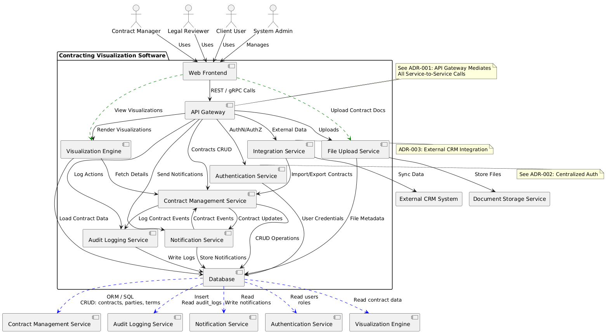
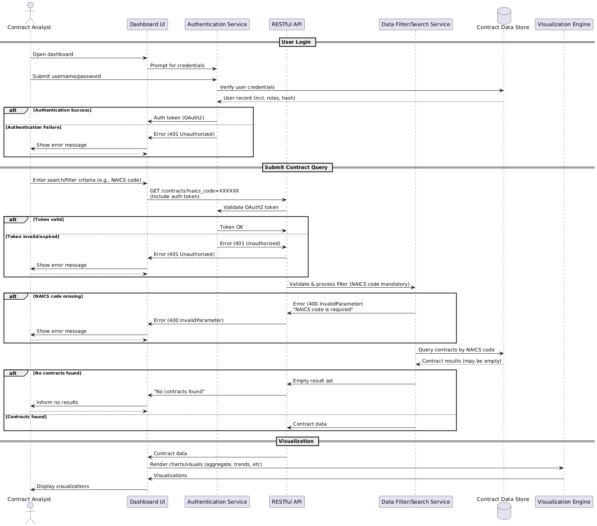

# Contracting Visualization Software - Design and Architecture Overview

Welcome to the architecture overview for the Contracting Visualization Software (ConVisoft). This document provides a comprehensive summary of the system’s design, data model, core interactions, and technical decisions. Use this as a guide to understand the structure, dependencies, and flow of information throughout the application.

---

## Table of Contents

- [System Diagrams](#system-diagrams)
  - [ERD Diagram](#erd-diagram)
  - [Context Diagram](#context-diagram)
  - [Sequence Diagram](#sequence-diagram)
- [Database Schema](#database-schema)
- [Related Documentation](#related-documentation)
- [Notes](#notes)
- [Summary](#summary)

---

## System Diagrams

### ERD Diagram

**Purpose:**  
The Entity-Relationship Diagram (ERD) illustrates the core data entities, their attributes, and the relationships between them within ConVisoft. Use this diagram to understand how data is structured and how entities such as Users, Contracts, Projects, and Visualizations relate to one another.


---

### Context Diagram

**Purpose:**  
The Context Diagram provides a high-level view of ConVisoft’s interactions with external actors and systems. It identifies key interfaces such as external contract data providers, authentication services, and user roles, clarifying integration points and system boundaries.




---

### Sequence Diagram

**Purpose:**  
The Sequence Diagram demonstrates the flow of messages and actions between major components during a typical user scenario (e.g., contract visualization request). It helps developers understand the order of operations and the responsibilities of each component in the system.




---

## Database Schema

**Purpose:**  
The database schema defines the structure and constraints of the underlying relational database. Review this SQL file for table definitions, primary/foreign key relationships, and any critical indices. The schema ensures data integrity and supports efficient queries for visualization and reporting.
```sql
-- Enable foreign-key enforcement in SQLite
PRAGMA foreign_keys = ON;

--------------------------------------------------------------------
-- 1. Reference / Lookup Tables
--------------------------------------------------------------------
CREATE TABLE naics_codes (
    naics_code        TEXT PRIMARY KEY,               -- 6-digit string
    description       TEXT NOT NULL
);

CREATE TABLE psc_codes (
    psc_code          TEXT PRIMARY KEY,               -- 4-character string
    description       TEXT NOT NULL
);

CREATE TABLE roles (
    role_id           INTEGER PRIMARY KEY,
    role_name         TEXT NOT NULL UNIQUE,           -- e.g., admin, analyst
    description       TEXT
);

--------------------------------------------------------------------
-- 2. Core Master Tables
--------------------------------------------------------------------
CREATE TABLE locations (
    location_id       INTEGER PRIMARY KEY,
    address_line1     TEXT NOT NULL,
    address_line2     TEXT,
    city              TEXT NOT NULL,
    state_province    TEXT NOT NULL,                  -- state, province, or region
    postal_code       TEXT NOT NULL,
    country_code      TEXT NOT NULL,                  -- ISO-3166-1 Alpha-2
    latitude          REAL,                           -- optional geo-coords
    longitude         REAL,
    CHECK (length(country_code) = 2)
);

CREATE TABLE companies (
    company_id        INTEGER PRIMARY KEY,
    legal_name        TEXT NOT NULL,
    duns_number       TEXT UNIQUE,                    -- 9-digit DUNS, may be NULL
    cage_code         TEXT UNIQUE,                    -- 5-char CAGE, may be NULL
    website_url       TEXT,
    founded_date      TEXT,                           -- ISO-8601 date
    primary_location_id INTEGER,                      -- HQ address
    created_at        TEXT NOT NULL DEFAULT CURRENT_TIMESTAMP,
    updated_at        TEXT NOT NULL DEFAULT CURRENT_TIMESTAMP,
    FOREIGN KEY (primary_location_id) REFERENCES locations(location_id)
        ON UPDATE CASCADE ON DELETE SET NULL
);

--------------------------------------------------------------------
-- 3. User / Auth Tables
--------------------------------------------------------------------
CREATE TABLE users (
    user_id           INTEGER PRIMARY KEY,
    username          TEXT NOT NULL UNIQUE,
    password_hash     TEXT NOT NULL,                  -- store only strong hashes
    email             TEXT NOT NULL UNIQUE,
    is_active         INTEGER NOT NULL DEFAULT 1 CHECK (is_active IN (0,1)),
    created_at        TEXT NOT NULL DEFAULT CURRENT_TIMESTAMP,
    updated_at        TEXT NOT NULL DEFAULT CURRENT_TIMESTAMP
);

CREATE TABLE user_roles (                              -- M:N users ⇄ roles
    user_id           INTEGER NOT NULL,
    role_id           INTEGER NOT NULL,
    assigned_at       TEXT NOT NULL DEFAULT CURRENT_TIMESTAMP,
    PRIMARY KEY (user_id, role_id),
    FOREIGN KEY (user_id) REFERENCES users(user_id)
        ON UPDATE CASCADE ON DELETE CASCADE,
    FOREIGN KEY (role_id) REFERENCES roles(role_id)
        ON UPDATE CASCADE ON DELETE CASCADE
);

--------------------------------------------------------------------
-- 4. Contract Tables
--------------------------------------------------------------------
CREATE TABLE contracts (
    contract_id       INTEGER PRIMARY KEY,
    contract_number   TEXT NOT NULL UNIQUE,           -- PIID / award identifier
    title             TEXT,
    description       TEXT,
    company_id        INTEGER NOT NULL,               -- awardee
    place_of_performance_location_id INTEGER,         -- optional
    date_awarded      TEXT NOT NULL,                  -- ISO-8601 date
    start_date        TEXT,
    end_date          TEXT,
    total_value       NUMERIC NOT NULL CHECK (total_value >= 0),
    total_obligated   NUMERIC CHECK (total_obligated >= 0),
    created_at        TEXT NOT NULL DEFAULT CURRENT_TIMESTAMP,
    updated_at        TEXT NOT NULL DEFAULT CURRENT_TIMESTAMP,
    FOREIGN KEY (company_id) REFERENCES companies(company_id)
        ON UPDATE CASCADE ON DELETE RESTRICT,
    FOREIGN KEY (place_of_performance_location_id) REFERENCES locations(location_id)
        ON UPDATE CASCADE ON DELETE SET NULL
);

--------------------------------------------------------------------
-- 5. Junction Tables for M:N Relationships
--------------------------------------------------------------------
CREATE TABLE contract_naics (                           -- contracts ⇄ NAICS
    contract_id       INTEGER NOT NULL,
    naics_code        TEXT    NOT NULL,
    PRIMARY KEY (contract_id, naics_code),
    FOREIGN KEY (contract_id) REFERENCES contracts(contract_id)
        ON UPDATE CASCADE ON DELETE CASCADE,
    FOREIGN KEY (naics_code)  REFERENCES naics_codes(naics_code)
        ON UPDATE CASCADE ON DELETE RESTRICT
);

CREATE TABLE contract_psc (                             -- contracts ⇄ PSC
    contract_id       INTEGER NOT NULL,
    psc_code          TEXT    NOT NULL,
    PRIMARY KEY (contract_id, psc_code),
    FOREIGN KEY (contract_id) REFERENCES contracts(contract_id)
        ON UPDATE CASCADE ON DELETE CASCADE,
    FOREIGN KEY (psc_code)   REFERENCES psc_codes(psc_code)
        ON UPDATE CASCADE ON DELETE RESTRICT
);

--------------------------------------------------------------------
-- 6. Helpful Indexes for Query Performance
--------------------------------------------------------------------
-- Frequently filtered columns
CREATE INDEX idx_contracts_date_awarded      ON contracts(date_awarded);
CREATE INDEX idx_contracts_total_value       ON contracts(total_value);
CREATE INDEX idx_contracts_company_id        ON contracts(company_id);

-- Lookup indexes (text columns are PK but additional indexes help partial searches)
CREATE INDEX idx_naics_description           ON naics_codes(description);
CREATE INDEX idx_psc_description             ON psc_codes(description);

-- Geospatial quick lookups
CREATE INDEX idx_locations_state_province    ON locations(state_province);
CREATE INDEX idx_locations_country_code      ON locations(country_code);
```
---

## Related Documentation

- [Product Requirements Document (PRD)](./convisoft_prd.md)
- [Architecture Decision Records (ADR)](./convisoft_adr.md)

---

## Notes

- **Image Paths:**  
  Ensure all image files (`.png`) and schema files (`.sql`) are located in the same directory as `architecture.md`.  
  Adjust the paths if the directory structure is different.

- **Viewing:**  
  When using VS Code, GitHub, or other markdown viewers, images and links will render correctly if the referenced files exist and the paths are accurate.

- **Updates:**  
  Keep this documentation in sync with project evolution. Update diagrams and schema as the system changes.

---

## Summary

This architecture overview is designed to help both developers and stakeholders quickly understand how the Contracting Visualization Software is structured and how its main components interact. For a deeper dive, consult the linked PRD and ADR files, and refer to the included diagrams and schema for implementation details. If you have any questions or suggestions, please contact the architecture team or open an issue in the repository.

---

*End of Document*