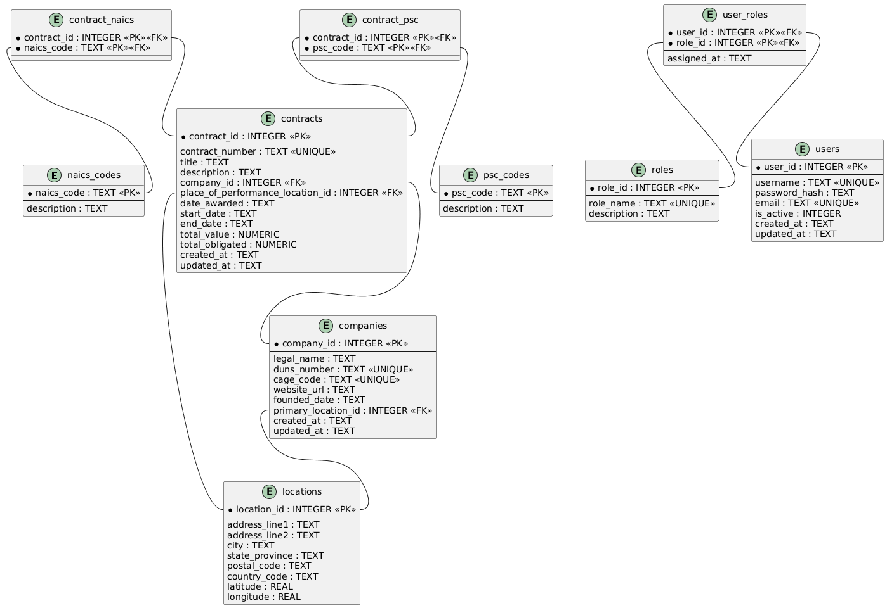

# Contracting Visualization Software - Design and Architecture Overview

## Introduction

This document provides a comprehensive overview of the design and architecture for the Contracting Visualization Software project. It details the system's components, their interactions, and the supporting diagrams that illustrate the underlying structure and workflows. This guide serves as a reference for developers, stakeholders, and architects to understand the system's layout, responsibilities, and integration points.

---

## System Overview and Description

The Contracting Visualization Software is a web-based platform designed to streamline the management, visualization, and analysis of contracts and related workflows. It enables users to upload, review, annotate, and track contracts throughout their lifecycle. The system integrates with external services, such as notification providers and document storage, to provide a seamless contracting experience. Core requirements include role-based access control, audit trails, and a robust data model to support complex contract relationships.

---

## Key Components and Their Roles

- **Frontend (Web Application):**
  - Provides an intuitive user interface for uploading, viewing, annotating, and managing contracts.
  - Handles user authentication and authorization.
  - Visualizes contract data and workflow status.

- **Backend (API & Business Logic):**
  - Exposes RESTful or GraphQL APIs for frontend consumption.
  - Manages business logic, contract workflow states, and permissions.
  - Connects to the data layer and external services.

- **Database:**
  - Stores contracts, users, workflow history, annotations, and metadata.
  - Enforces data integrity and relationships.

- **External Integrations:**
  - **Document Storage:** For storing contract files securely (e.g., AWS S3, Azure Blob).
  - **Notification Service:** Sends alerts or emails to stakeholders during workflow events.
  - **Authentication Provider:** Handles user sign-in and identity management (e.g., OAuth, SAML).

- **Admin & Audit Module:**
  - Provides admin interfaces for managing users, roles, and access.
  - Maintains audit logs for compliance and traceability.

---

## Architecture Diagrams

### ERD Diagram

**Purpose:**  
Illustrates the core data model, including entities (such as Contract, User, Workflow), their attributes, and the relationships between them. This diagram is essential for understanding data structure, integrity constraints, and normalization.



---

### Context Diagram

**Purpose:**  
Shows the system's boundaries and its interactions with external entities (users, integration services, storage, etc.). This high-level view helps stakeholders understand the system's environment, interfaces, and dependencies.


---

### Sequence Diagram

**Purpose:**  
Depicts a typical flow of messages and method calls between system components for a key use case (e.g., contract upload and approval). This visualization clarifies component responsibilities and the order of operations.


---

## Database Schema

**Purpose:**  
The database schema defines the structure and constraints of the underlying relational database. Review this SQL file for table definitions, primary/foreign key relationships, and any critical indices. The schema ensures data integrity and supports efficient queries for visualization and reporting.
```sql
-- Enable foreign-key enforcement in SQLite
PRAGMA foreign_keys = ON;

--------------------------------------------------------------------
-- 1. Reference / Lookup Tables
--------------------------------------------------------------------
CREATE TABLE naics_codes (
    naics_code        TEXT PRIMARY KEY,               -- 6-digit string
    description       TEXT NOT NULL
);

CREATE TABLE psc_codes (
    psc_code          TEXT PRIMARY KEY,               -- 4-character string
    description       TEXT NOT NULL
);

CREATE TABLE roles (
    role_id           INTEGER PRIMARY KEY,
    role_name         TEXT NOT NULL UNIQUE,           -- e.g., admin, analyst
    description       TEXT
);

--------------------------------------------------------------------
-- 2. Core Master Tables
--------------------------------------------------------------------
CREATE TABLE locations (
    location_id       INTEGER PRIMARY KEY,
    address_line1     TEXT NOT NULL,
    address_line2     TEXT,
    city              TEXT NOT NULL,
    state_province    TEXT NOT NULL,                  -- state, province, or region
    postal_code       TEXT NOT NULL,
    country_code      TEXT NOT NULL,                  -- ISO-3166-1 Alpha-2
    latitude          REAL,                           -- optional geo-coords
    longitude         REAL,
    CHECK (length(country_code) = 2)
);

CREATE TABLE companies (
    company_id        INTEGER PRIMARY KEY,
    legal_name        TEXT NOT NULL,
    duns_number       TEXT UNIQUE,                    -- 9-digit DUNS, may be NULL
    cage_code         TEXT UNIQUE,                    -- 5-char CAGE, may be NULL
    website_url       TEXT,
    founded_date      TEXT,                           -- ISO-8601 date
    primary_location_id INTEGER,                      -- HQ address
    created_at        TEXT NOT NULL DEFAULT CURRENT_TIMESTAMP,
    updated_at        TEXT NOT NULL DEFAULT CURRENT_TIMESTAMP,
    FOREIGN KEY (primary_location_id) REFERENCES locations(location_id)
        ON UPDATE CASCADE ON DELETE SET NULL
);

--------------------------------------------------------------------
-- 3. User / Auth Tables
--------------------------------------------------------------------
CREATE TABLE users (
    user_id           INTEGER PRIMARY KEY,
    username          TEXT NOT NULL UNIQUE,
    password_hash     TEXT NOT NULL,                  -- store only strong hashes
    email             TEXT NOT NULL UNIQUE,
    is_active         INTEGER NOT NULL DEFAULT 1 CHECK (is_active IN (0,1)),
    created_at        TEXT NOT NULL DEFAULT CURRENT_TIMESTAMP,
    updated_at        TEXT NOT NULL DEFAULT CURRENT_TIMESTAMP
);

CREATE TABLE user_roles (                              -- M:N users ⇄ roles
    user_id           INTEGER NOT NULL,
    role_id           INTEGER NOT NULL,
    assigned_at       TEXT NOT NULL DEFAULT CURRENT_TIMESTAMP,
    PRIMARY KEY (user_id, role_id),
    FOREIGN KEY (user_id) REFERENCES users(user_id)
        ON UPDATE CASCADE ON DELETE CASCADE,
    FOREIGN KEY (role_id) REFERENCES roles(role_id)
        ON UPDATE CASCADE ON DELETE CASCADE
);

--------------------------------------------------------------------
-- 4. Contract Tables
--------------------------------------------------------------------
CREATE TABLE contracts (
    contract_id       INTEGER PRIMARY KEY,
    contract_number   TEXT NOT NULL UNIQUE,           -- PIID / award identifier
    title             TEXT,
    description       TEXT,
    company_id        INTEGER NOT NULL,               -- awardee
    place_of_performance_location_id INTEGER,         -- optional
    date_awarded      TEXT NOT NULL,                  -- ISO-8601 date
    start_date        TEXT,
    end_date          TEXT,
    total_value       NUMERIC NOT NULL CHECK (total_value >= 0),
    total_obligated   NUMERIC CHECK (total_obligated >= 0),
    created_at        TEXT NOT NULL DEFAULT CURRENT_TIMESTAMP,
    updated_at        TEXT NOT NULL DEFAULT CURRENT_TIMESTAMP,
    FOREIGN KEY (company_id) REFERENCES companies(company_id)
        ON UPDATE CASCADE ON DELETE RESTRICT,
    FOREIGN KEY (place_of_performance_location_id) REFERENCES locations(location_id)
        ON UPDATE CASCADE ON DELETE SET NULL
);

--------------------------------------------------------------------
-- 5. Junction Tables for M:N Relationships
--------------------------------------------------------------------
CREATE TABLE contract_naics (                           -- contracts ⇄ NAICS
    contract_id       INTEGER NOT NULL,
    naics_code        TEXT    NOT NULL,
    PRIMARY KEY (contract_id, naics_code),
    FOREIGN KEY (contract_id) REFERENCES contracts(contract_id)
        ON UPDATE CASCADE ON DELETE CASCADE,
    FOREIGN KEY (naics_code)  REFERENCES naics_codes(naics_code)
        ON UPDATE CASCADE ON DELETE RESTRICT
);

CREATE TABLE contract_psc (                             -- contracts ⇄ PSC
    contract_id       INTEGER NOT NULL,
    psc_code          TEXT    NOT NULL,
    PRIMARY KEY (contract_id, psc_code),
    FOREIGN KEY (contract_id) REFERENCES contracts(contract_id)
        ON UPDATE CASCADE ON DELETE CASCADE,
    FOREIGN KEY (psc_code)   REFERENCES psc_codes(psc_code)
        ON UPDATE CASCADE ON DELETE RESTRICT
);

--------------------------------------------------------------------
-- 6. Helpful Indexes for Query Performance
--------------------------------------------------------------------
-- Frequently filtered columns
CREATE INDEX idx_contracts_date_awarded      ON contracts(date_awarded);
CREATE INDEX idx_contracts_total_value       ON contracts(total_value);
CREATE INDEX idx_contracts_company_id        ON contracts(company_id);

-- Lookup indexes (text columns are PK but additional indexes help partial searches)
CREATE INDEX idx_naics_description           ON naics_codes(description);
CREATE INDEX idx_psc_description             ON psc_codes(description);

-- Geospatial quick lookups
CREATE INDEX idx_locations_state_province    ON locations(state_province);
CREATE INDEX idx_locations_country_code      ON locations(country_code);
```
---


## Supporting Documentation

- [Product Requirements Document (PRD)](./convisoft_prd.md)  
  *Defines the business requirements, user stories, and acceptance criteria.*

- [Architecture Decision Records (ADR)](./convisoft_adr.md)  
  *Documents key architectural decisions, trade-offs, and rationale.*

---

## Notes

- **Diagram Files:**  
  Ensure that `convisoft_erd_diagram.png`, `convisoft_context_diagram.png`, and `convisoft_sequence_diagram.png` are located in the same directory as `architecture.md`. Adjust paths if files are stored elsewhere.

- **Viewing:**  
  When viewing in Visual Studio Code, GitHub, or compatible markdown viewers, images and links should render automatically if files and paths are correct.

- **Schema Reference:**  
  Refer to the ERD and accompanying schema documentation for details on database tables, fields, and relationships.

---

## Summary

This architecture overview provides a high-level yet comprehensive understanding of the Contracting Visualization Software system. By referencing the system’s components, key diagrams, and supporting documents, developers and stakeholders can quickly orient themselves and collaborate effectively. For further details or implementation specifics, consult the linked PRD, ADR, and schema resources.

---

*For questions, context, or contributions, please refer to the linked documentation or contact the architecture team.*